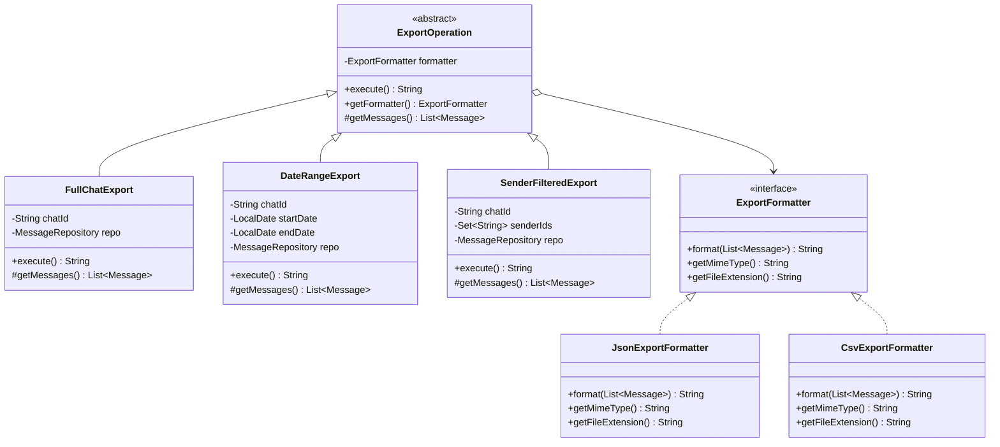
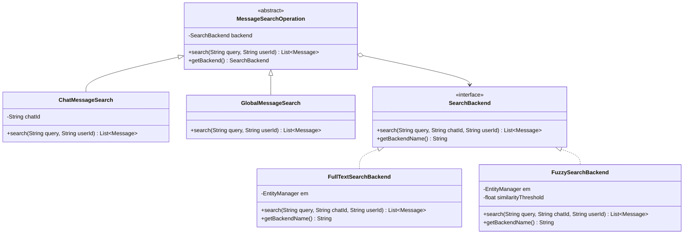

## Chat Export Bridge

```mermaid
classDiagram
    class ExportOperation {
        <<abstract>>
        -ExportFormatter formatter
        +execute() String
        +getFormatter() ExportFormatter
        #getMessages() List~Message~
    }
    
    class FullChatExport {
        -String chatId
        -MessageRepository repo
        +execute() String
        #getMessages() List~Message~
    }
    
    class DateRangeExport {
        -String chatId
        -LocalDate startDate
        -LocalDate endDate
        -MessageRepository repo
        +execute() String
        #getMessages() List~Message~
    }
    
    class SenderFilteredExport {
        -String chatId
        -Set~String~ senderIds
        -MessageRepository repo
        +execute() String
        #getMessages() List~Message~
    }
    
    class ExportFormatter {
        <<interface>>
        +format(List~Message~) String
        +getMimeType() String
        +getFileExtension() String
    }
    
    class JsonExportFormatter {
        +format(List~Message~) String
        +getMimeType() String
        +getFileExtension() String
    }
    
    class CsvExportFormatter {
        +format(List~Message~) String
        +getMimeType() String
        +getFileExtension() String
    }
    
    ExportOperation <|-- FullChatExport
    ExportOperation <|-- DateRangeExport
    ExportOperation <|-- SenderFilteredExport
    ExportOperation o--> ExportFormatter
    ExportFormatter <|.. JsonExportFormatter
    ExportFormatter <|.. CsvExportFormatter
```

## Message Search Bridge

```mermaid
classDiagram
    class MessageSearchOperation {
        <<abstract>>
        -SearchBackend backend
        +search(String query, String userId) List~Message~
        +getBackend() SearchBackend
    }
    
    class ChatMessageSearch {
        -String chatId
        +search(String query, String userId) List~Message~
    }
    
    class GlobalMessageSearch {
        +search(String query, String userId) List~Message~
    }
    
    class SearchBackend {
        <<interface>>
        +search(String query, String chatId, String userId) List~Message~
        +getBackendName() String
    }
    
    class FullTextSearchBackend {
        -EntityManager em
        +search(String query, String chatId, String userId) List~Message~
        +getBackendName() String
    }
    
    class FuzzySearchBackend {
        -EntityManager em
        -float similarityThreshold
        +search(String query, String chatId, String userId) List~Message~
        +getBackendName() String
    }
    
    MessageSearchOperation <|-- ChatMessageSearch
    MessageSearchOperation <|-- GlobalMessageSearch
    MessageSearchOperation o--> SearchBackend
    SearchBackend <|.. FullTextSearchBackend
    SearchBackend <|.. FuzzySearchBackend
```