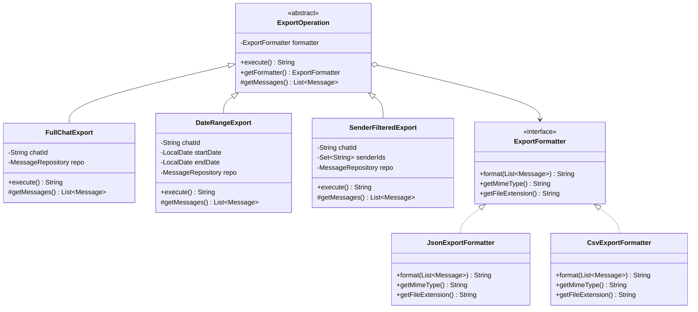
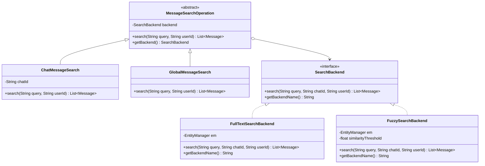
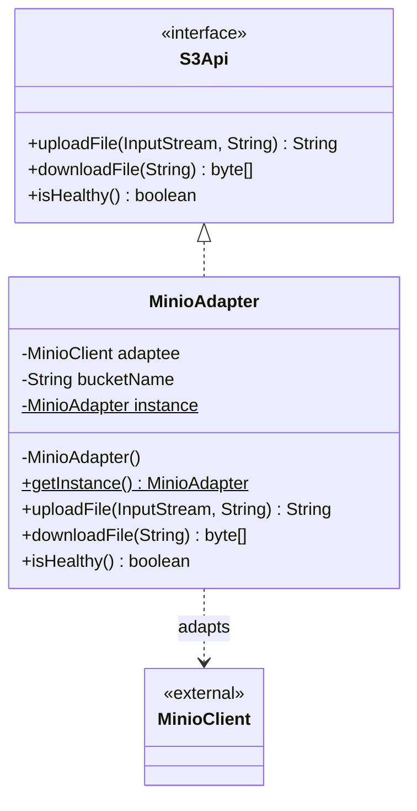
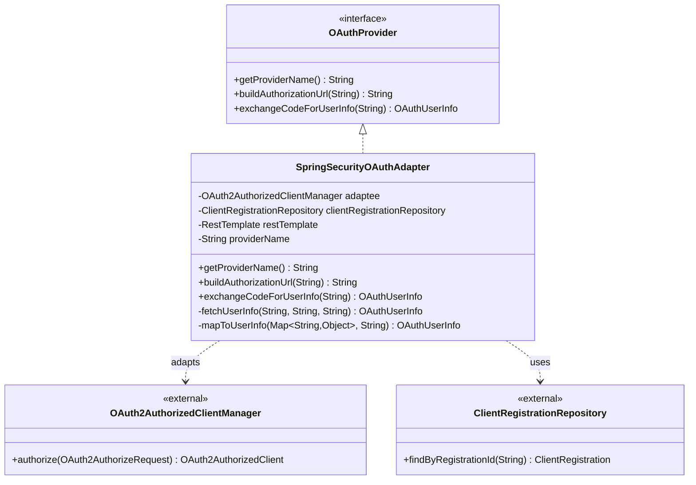
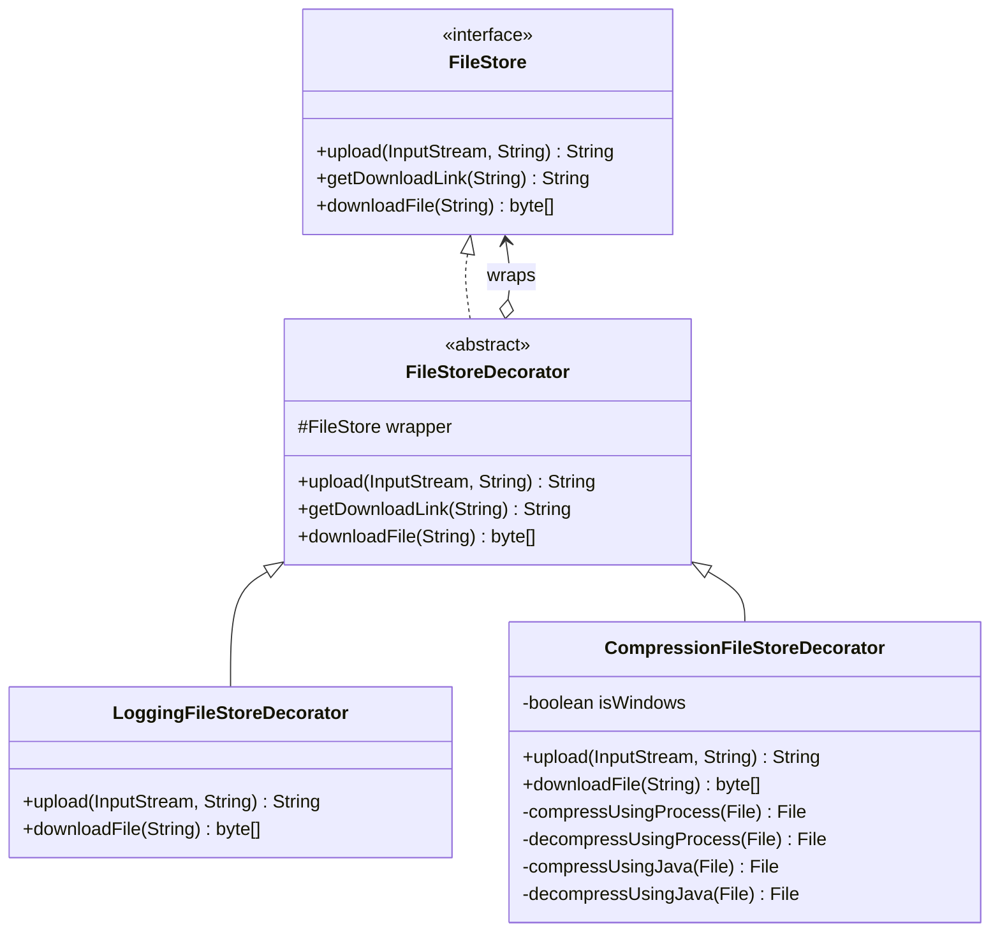
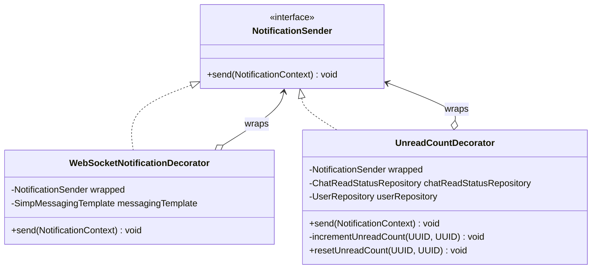
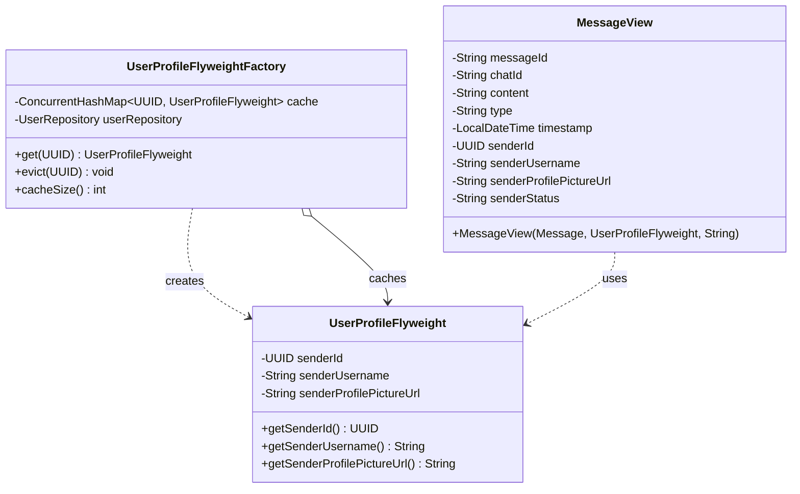

## Chat Export Bridge

```mermaid
classDiagram
    class ExportOperation {
        <<abstract>>
        -ExportFormatter formatter
        +execute() String
        +getFormatter() ExportFormatter
        #getMessages() List~Message~
    }
    
    class FullChatExport {
        -String chatId
        -MessageRepository repo
        +execute() String
        #getMessages() List~Message~
    }
    
    class DateRangeExport {
        -String chatId
        -LocalDate startDate
        -LocalDate endDate
        -MessageRepository repo
        +execute() String
        #getMessages() List~Message~
    }
    
    class SenderFilteredExport {
        -String chatId
        -Set~String~ senderIds
        -MessageRepository repo
        +execute() String
        #getMessages() List~Message~
    }
    
    class ExportFormatter {
        <<interface>>
        +format(List~Message~) String
        +getMimeType() String
        +getFileExtension() String
    }
    
    class JsonExportFormatter {
        +format(List~Message~) String
        +getMimeType() String
        +getFileExtension() String
    }
    
    class CsvExportFormatter {
        +format(List~Message~) String
        +getMimeType() String
        +getFileExtension() String
    }
    
    ExportOperation <|-- FullChatExport
    ExportOperation <|-- DateRangeExport
    ExportOperation <|-- SenderFilteredExport
    ExportOperation o--> ExportFormatter
    ExportFormatter <|.. JsonExportFormatter
    ExportFormatter <|.. CsvExportFormatter
```

## Message Search Bridge

```mermaid
classDiagram
    class MessageSearchOperation {
        <<abstract>>
        -SearchBackend backend
        +search(String query, String userId) List~Message~
        +getBackend() SearchBackend
    }
    
    class ChatMessageSearch {
        -String chatId
        +search(String query, String userId) List~Message~
    }
    
    class GlobalMessageSearch {
        +search(String query, String userId) List~Message~
    }
    
    class SearchBackend {
        <<interface>>
        +search(String query, String chatId, String userId) List~Message~
        +getBackendName() String
    }
    
    class FullTextSearchBackend {
        -EntityManager em
        +search(String query, String chatId, String userId) List~Message~
        +getBackendName() String
    }
    
    class FuzzySearchBackend {
        -EntityManager em
        -float similarityThreshold
        +search(String query, String chatId, String userId) List~Message~
        +getBackendName() String
    }
    
    MessageSearchOperation <|-- ChatMessageSearch
    MessageSearchOperation <|-- GlobalMessageSearch
    MessageSearchOperation o--> SearchBackend
    SearchBackend <|.. FullTextSearchBackend
    SearchBackend <|.. FuzzySearchBackend
```

## File Storage Adapter

```mermaid
classDiagram
    class S3Api {
        <<interface>>
        +uploadFile(InputStream, String) String
        +downloadFile(String) byte[]
        +isHealthy() boolean
    }
    
    class MinioAdapter {
        -MinioClient adaptee
        -String bucketName
        -MinioAdapter instance$
        -MinioAdapter()
        +getInstance() MinioAdapter$
        +uploadFile(InputStream, String) String
        +downloadFile(String) byte[]
        +isHealthy() boolean
    }
    
    class MinioClient {
        <<external>>
    }
    
    S3Api <|.. MinioAdapter
    MinioAdapter ..> MinioClient : adapts
```

## OAuth Provider Adapter

```mermaid
classDiagram
    class OAuthProvider {
        <<interface>>
        +getProviderName() String
        +buildAuthorizationUrl(String) String
        +exchangeCodeForUserInfo(String) OAuthUserInfo
    }
    
    class SpringSecurityOAuthAdapter {
        -OAuth2AuthorizedClientManager adaptee
        -ClientRegistrationRepository clientRegistrationRepository
        -RestTemplate restTemplate
        -String providerName
        +getProviderName() String
        +buildAuthorizationUrl(String) String
        +exchangeCodeForUserInfo(String) OAuthUserInfo
        -fetchUserInfo(String, String, String) OAuthUserInfo
        -mapToUserInfo(Map~String,Object~, String) OAuthUserInfo
    }
    
    class OAuth2AuthorizedClientManager {
        <<external>>
        +authorize(OAuth2AuthorizeRequest) OAuth2AuthorizedClient
    }
    
    class ClientRegistrationRepository {
        <<external>>
        +findByRegistrationId(String) ClientRegistration
    }
    
    OAuthProvider <|.. SpringSecurityOAuthAdapter
    SpringSecurityOAuthAdapter ..> OAuth2AuthorizedClientManager : adapts
    SpringSecurityOAuthAdapter ..> ClientRegistrationRepository : uses
```

## FileStore Decorator

```mermaid
classDiagram
    class FileStore {
        <<interface>>
        +upload(InputStream, String) String
        +getDownloadLink(String) String
        +downloadFile(String) byte[]
    }
    
    class FileStoreDecorator {
        <<abstract>>
        #FileStore wrapper
        +upload(InputStream, String) String
        +getDownloadLink(String) String
        +downloadFile(String) byte[]
    }
    
    class LoggingFileStoreDecorator {
        +upload(InputStream, String) String
        +downloadFile(String) byte[]
    }
    
    class CompressionFileStoreDecorator {
        -boolean isWindows
        +upload(InputStream, String) String
        +downloadFile(String) byte[]
        -compressUsingProcess(File) File
        -decompressUsingProcess(File) File
        -compressUsingJava(File) File
        -decompressUsingJava(File) File
    }
    
    FileStore <|.. FileStoreDecorator
    FileStoreDecorator <|-- LoggingFileStoreDecorator
    FileStoreDecorator <|-- CompressionFileStoreDecorator
    FileStoreDecorator o--> FileStore : wraps
```

## Notification Sender Decorator

```mermaid
classDiagram
    class NotificationSender {
        <<interface>>
        +send(NotificationContext) void
    }
    
    class WebSocketNotificationDecorator {
        -NotificationSender wrapped
        -SimpMessagingTemplate messagingTemplate
        +send(NotificationContext) void
    }
    
    class UnreadCountDecorator {
        -NotificationSender wrapped
        -ChatReadStatusRepository chatReadStatusRepository
        -UserRepository userRepository
        +send(NotificationContext) void
        -incrementUnreadCount(UUID, UUID) void
        +resetUnreadCount(UUID, UUID) void
    }
    
    NotificationSender <|.. WebSocketNotificationDecorator
    NotificationSender <|.. UnreadCountDecorator
    WebSocketNotificationDecorator o--> NotificationSender : wraps
    UnreadCountDecorator o--> NotificationSender : wraps
```

## User Profile Flyweight

```mermaid
classDiagram
    class UserProfileFlyweight {
        -UUID senderId
        -String senderUsername
        -String senderProfilePictureUrl
        +getSenderId() UUID
        +getSenderUsername() String
        +getSenderProfilePictureUrl() String
    }
    
    class UserProfileFlyweightFactory {
        -ConcurrentHashMap~UUID, UserProfileFlyweight~ cache
        -UserRepository userRepository
        +get(UUID) UserProfileFlyweight
        +evict(UUID) void
        +cacheSize() int
    }
    
    class MessageView {
        -String messageId
        -String chatId
        -String content
        -String type
        -LocalDateTime timestamp
        -UUID senderId
        -String senderUsername
        -String senderProfilePictureUrl
        -String senderStatus
        +MessageView(Message, UserProfileFlyweight, String)
    }
    
    UserProfileFlyweightFactory ..> UserProfileFlyweight : creates
    UserProfileFlyweightFactory o--> UserProfileFlyweight : caches
    MessageView ..> UserProfileFlyweight : uses
```